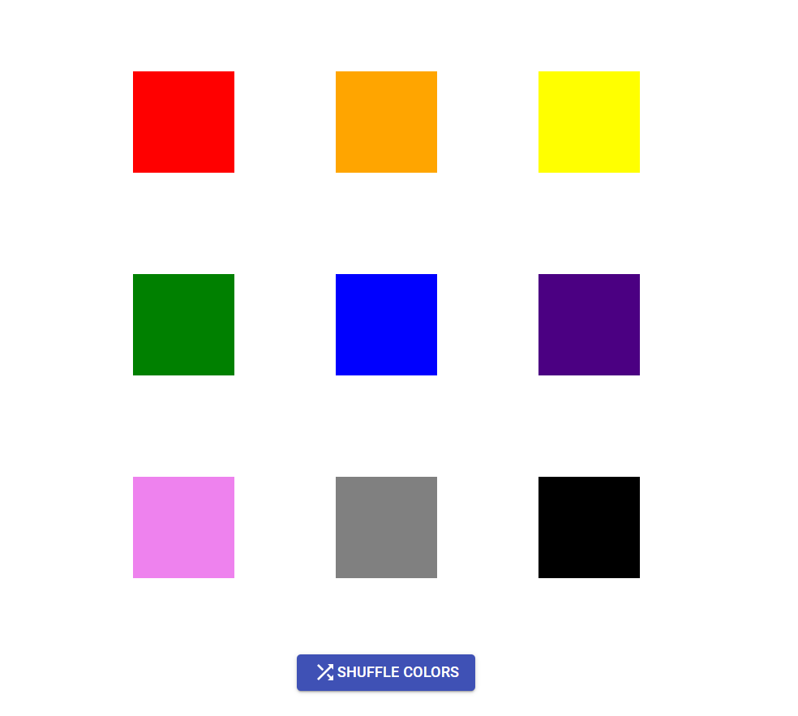

# JSON COLOR BOXES

React, NodeJS, HTML, CSS, MaterialUI, Docker

## INSTALL and RUN 
> npm install 

> npm start    #Port: 3000

## Docker
> docker build -t json-color-boxes .

> docker run -d -p 3000:3000 json-color-boxes
